# Network Intrusion Detection using QML

> This project allows for a comparitive study of Network Intrusion Detection (NID) using both classical and quantum machine learning.

## Project Overview

This project can be treated as a survey project that helps to analyse the performance of the state of the art classication models in the classical ML universe against their counterparts in the Quantum world.

This will also take into consideration top of the line classication models from the Quantum world (whose counterparts may or may not exist in the classical world).

---

## Goals & Success Metrics

### Primary Goal

* Evaluate whether quantum ML methods can improve intrusion detection over tuned classical baselines.

### Questions

* Which Quantum based method outperform classical methods (RF/DT/SVM) on reduced features?​

* What conditions (small-data, specific attack classes, noisy hardware) favour QML?​

* Which pre-processing choices prevent attack signal recognition in QML?

### Metrics

* F1-score / Accuracy / Precision / Recall on a test set

---

The other components can be versioned as is compatible with the above python and qiskit versions.

## Repository Structure

```text
README.md
requirements.txt                  # Python dependencies
src/
  data/                           # Datasets and preprocessing utilities
    preprocessing.py              # Common preprocessing functions
    merge_cicids.py               # Script to merge CIC-IDS2017 files
    KDDTrain+.txt                 # NSL-KDD training data
    KDDTest+.txt                  # NSL-KDD test data
    CIC-IDS2017-merged.csv        # Merged CIC-IDS2017 dataset
  model/                          # Model architectures and training scripts
    classical/                    # Classical ML models
      decision_tree/
      random_forest/
      svm/
      k_means/
    quantum/                      # Quantum ML models
      qsvm/
      vqc/
      qcnn/
      k_means/
  plot/                           # Visualization and plotting scripts
    plot.ipynb
```

---

## Setup & Installation

### 1. Clone the Repository

```bash
git clone https://github.com/jakeislive/Quantum-Sentinel.git
cd Quantum-Sentinel
```

### 2. Create Virtual Environment (Recommended)

```bash
# Using venv
python -m venv venv
source venv/bin/activate  # On Windows: venv\Scripts\activate

# Or using conda
conda create -n quantum-sentinel python=3.12
conda activate quantum-sentinel
```

### 3. Install Dependencies

```bash
pip install -r requirements.txt
```

This will install all required packages including:

* NumPy, Pandas - Data processing
* Scikit-learn - Classical ML algorithms
* Qiskit - Quantum computing framework
* PyTorch - Deep learning
* Matplotlib - Visualization
* Jupyter - For interactive notebooks

---

## Data Setup

### NSL-KDD Dataset

The NSL-KDD dataset files are already included in `src/data/`:

* `KDDTrain+.txt` - Training set
* `KDDTest+.txt` - Test set

No additional setup required for NSL-KDD.

### CIC-IDS2017 Dataset

#### Step 1: Download the Dataset

Download the CIC-IDS2017 dataset from the official source:

* **Official Link**: [Canadian Institute for Cybersecurity](https://www.unb.ca/cic/datasets/ids-2017.html)
* **Alternative**: [Kaggle - CIC-IDS2017](https://www.kaggle.com/datasets/cicdataset/cicids2017)

The dataset contains CSV files for each day of the week:

* `Monday-WorkingHours.pcap_ISCX.csv`
* `Tuesday-WorkingHours.pcap_ISCX.csv`
* `Wednesday-workingHours.pcap_ISCX.csv`
* `Thursday-WorkingHours-Morning-WebAttacks.pcap_ISCX.csv`
* `Thursday-WorkingHours-Afternoon-Infilteration.pcap_ISCX.csv`
* `Friday-WorkingHours-Morning.pcap_ISCX.csv`
* `Friday-WorkingHours-Afternoon-DDos.pcap_ISCX.csv`
* `Friday-WorkingHours-Afternoon-PortScan.pcap_ISCX.csv`

#### Step 2: Extract Files

Extract all CSV files and place them in the `src/data/` directory.

#### Step 3: Merge the Dataset

Run the preprocessing script to merge all CSV files:

```bash
cd src/data
python merge_cicids.py
```

This will:

1. Read all 8 individual CSV files
2. Concatenate them into a single DataFrame
3. Save the merged dataset as `CIC-IDS2017-merged.csv`

The merged file will be approximately 2.8M rows and is required for running the CIC-IDS models.

**Expected Output:**

```text
Starting CIC-IDS2017 dataset merge...

✓ Loaded Monday-WorkingHours.pcap_ISCX.csv: (529918, 79)
✓ Loaded Tuesday-WorkingHours.pcap_ISCX.csv: (445909, 79)
...
✓ Merged shape: (2830743, 79)
✓ Successfully saved merged dataset!

Final dataset: 2,830,743 rows × 79 columns
```

---

## Running Models

### Classical Models (NSL-KDD)

```bash
cd src/model/classical/decision_tree
python decision_tree_classical.py
```

### Classical Models (CIC-IDS)

```bash
cd src/model/classical/decision_tree
python cicids_decision_tree_classical.py
```

### Quantum Models (NSL-KDD)

```bash
cd src/model/quantum/qsvm
python svm_quantum.py
```

### Quantum Models (CIC-IDS)

```bash
cd src/model/quantum/qsvm
python cicids_svm_quantum.py
```

Replace the directory and filename with the desired model to run different experiments.

---

## Results & Visualizations

### Key Findings

* **Classical Models**: Demonstrate superior accuracy (>99%) on CIC-IDS2017 with fast training times
* **Quantum Models**: Show promise with 75-85% accuracy on NSL-KDD, competitive on smaller datasets
* **Scalability**: Quantum K-Means shows excellent scalability characteristics
* **Trade-offs**: Quantum models require longer training times but may offer advantages in specific scenarios (small data, specific attack patterns)


#### Algorithm Performance Summary

| Model | Type | Accuracy | F1-Score |
|-------|------|----------|----------|
| Decision Tree | Classical | 0.7853 | 0.7742 |
| Random Forest | Classical | 0.7648 | 0.7462 |
| SVM (RBF) | Classical | 0.7886 | 0.7868 |
| K-Means | Classical | 0.6000 | 0.8408 |
| VQC | Quantum | 0.6900 | 0.6400 |
| QCNN | Quantum | 0.8000 | 0.8100 |
| QSVM | Quantum | 0.7500 | 0.7222 |
| Quantum K-Means | Quantum | 0.8480 | 0.8216 |

---

### NSL-KDD Dataset Results

#### Classical Models Performance

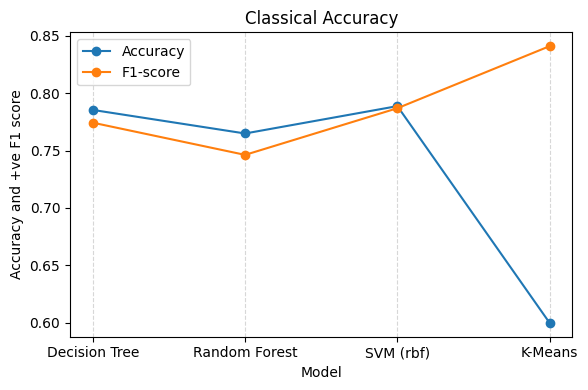

Classical machine learning models demonstrate strong performance on the NSL-KDD dataset, with Decision Tree and Random Forest achieving the highest accuracy scores.

#### Quantum Models Performance

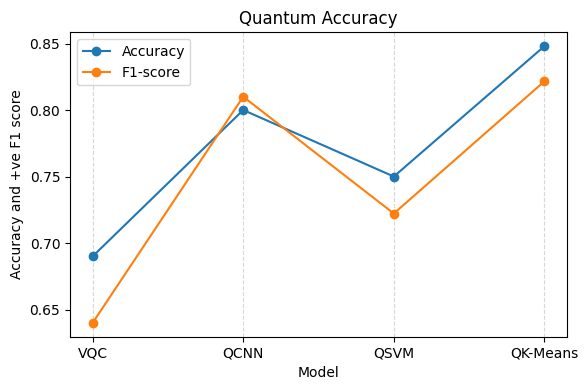

Quantum models show competitive performance, with Quantum K-Means and QCNN achieving notable accuracy scores.

#### Individual Model Analysis

##### Quantum Support Vector Machine (QSVM)

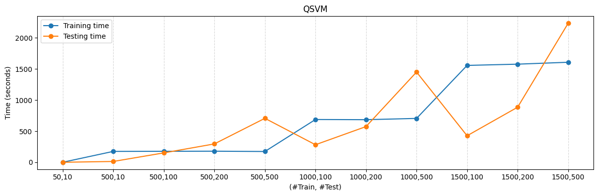
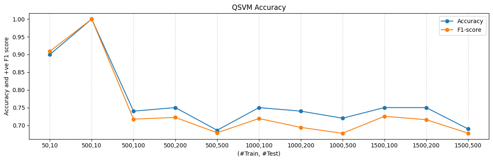

QSVM training and testing time scales with dataset size. Best accuracy achieved with medium-sized training sets (500-1000 samples).

##### Variational Quantum Classifier (VQC)

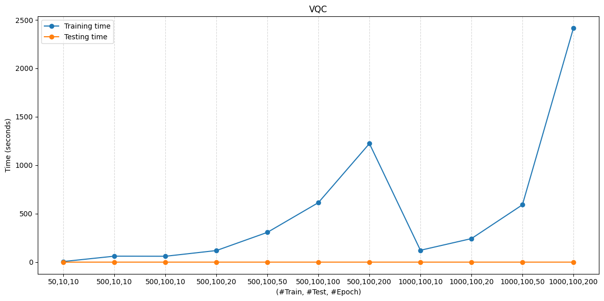
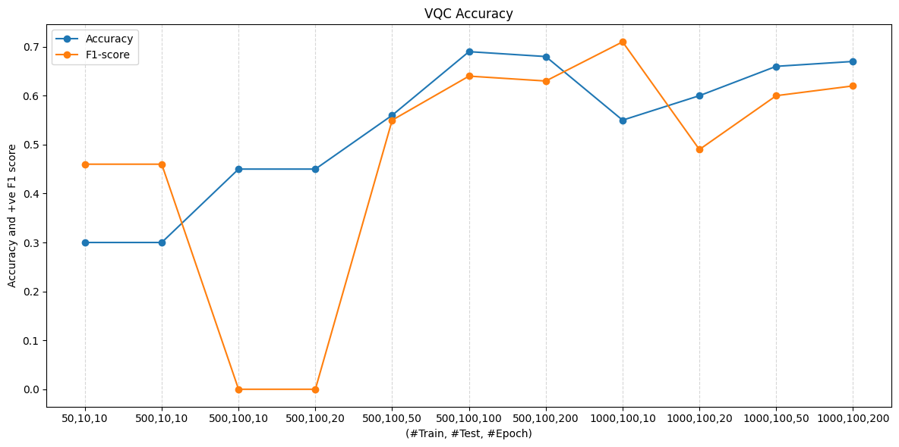

VQC shows improved accuracy with increased epochs. Training time grows linearly with the number of epochs.

##### Quantum Convolutional Neural Network (QCNN)

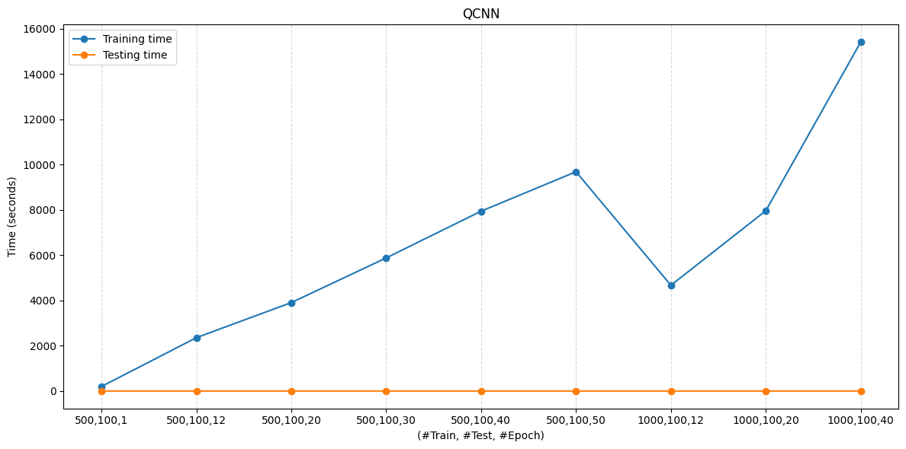
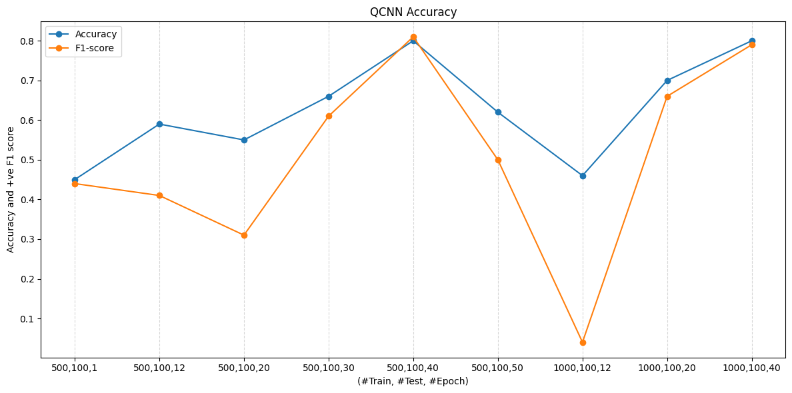

QCNN achieves high accuracy (up to 80%) with sufficient training epochs. Training time is proportional to epochs and dataset size.

##### Quantum K-Means

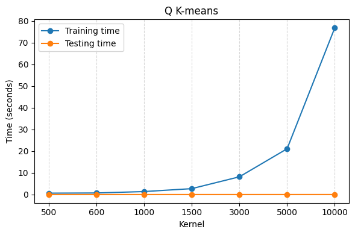
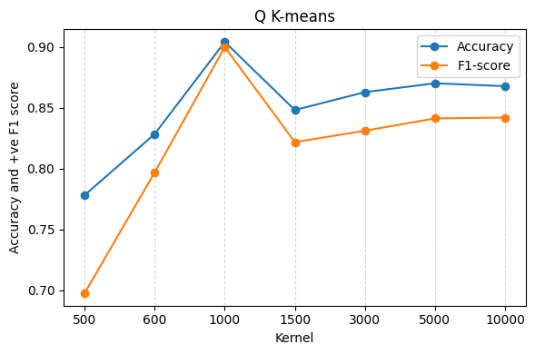

Quantum K-Means demonstrates excellent scalability with consistent performance across varying training set sizes.

##### Classical Support Vector Machine (SVM)

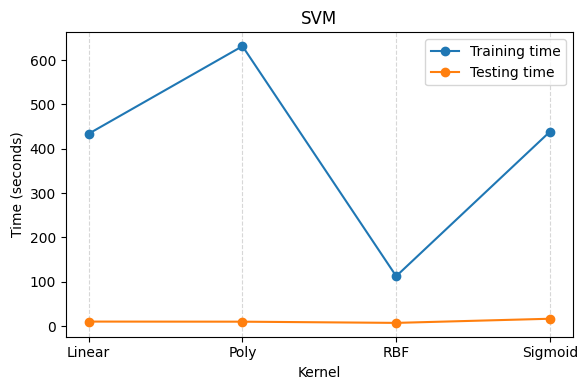
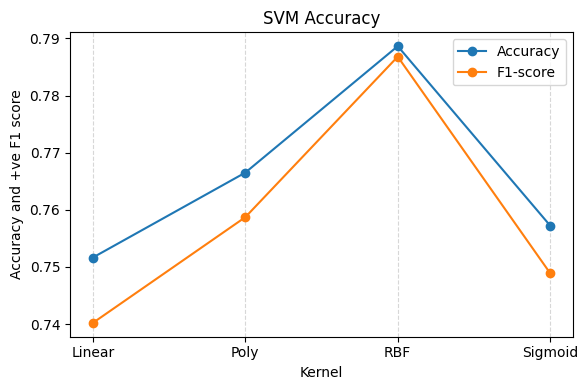

Classical SVM with RBF kernel achieves the best accuracy among different kernel types, though with moderate training time.

---

### CIC-IDS2017 Dataset Results

#### Classical Models - CIC-IDS2017

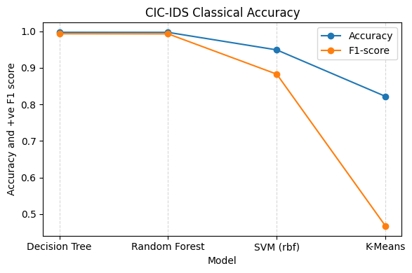

On the CIC-IDS2017 dataset, classical models maintain excellent performance with Decision Tree and Random Forest achieving >99% accuracy.

#### Quantum Models - CIC-IDS2017

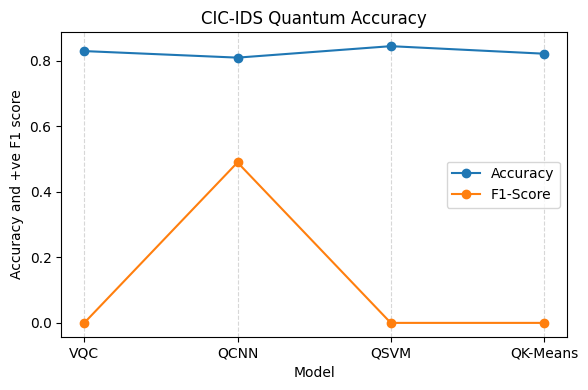

Quantum models show promising results on CIC-IDS2017, with QSVM and Quantum K-Means achieving competitive accuracy scores.

---

## License

This project is licensed under the terms of the MIT license.

---
